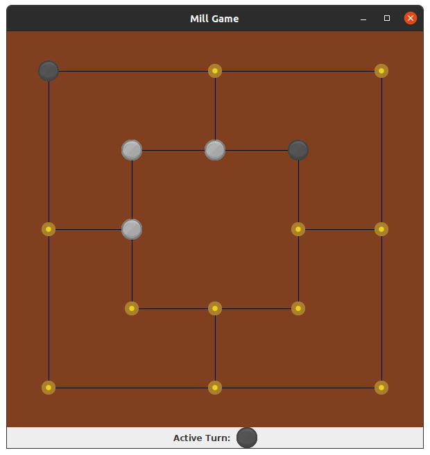

 # MillGame
 
 <!-- someone can help me to align these badges to the center! I'm so bad in html -->
<div style="text-align: center;margin-left:auto;margin-right:auto;width:500px">  
  
  
[](https://github.com/Billy-freespace/MillGame/actions/workflows/build.yml)
[](https://github.com/Billy-freespace/MillGame/actions/workflows/pmd.yml)
[](https://codecov.io/gh/Billy-freespace/MillGame)
[](https://www.codacy.com/gh/Billy-freespace/MillGame/dashboard?utm_source=github.com&amp;utm_medium=referral&amp;utm_content=Billy-freespace/MillGame&amp;utm_campaign=Badge_Grade)
  

</div>


**MillGame** is a game that implement the `Nine men's morris` strategy board game. But it also include several variants of this game. So if you get bored, just change the game's variant or challenge you with the `NINJA` robot player.

## Quickstart
**NOTE:** If you prefer use maven instead of gradle, we include alternative commands to build, test and run the game.

#### Run game
* Minimal GUI version (include cli arguments to configure your game)
```bash
./gradlew minimal

mvn compile exec:java -Dexec.mainClass=com.example.millgame.AppMinimal


# To get available game configuration options
./gradlew minimal --args="-h"

mvn compile exec:java -Dexec.mainClass=com.example.millgame.AppMinimal -Dexec.args=-h
```
* Complete GUI version (include panels to configure your game)**[STATE: in development]**
```bash
./gradlew run

mvn compile exec:java -Dexec.mainClass=com.example.millgame.App
```

#### Run unit tests
```bash
./gradlew test

mvn test
```

#### Build Game

```bash
# include pmd and checkstyle tasks
./gradlew build

# maven does not include pmd tasks yet
mvn compile


# exclude pmd and checkstyle tasks (ONLY BUILD)
./gradlew build -x check
```


#### Static Analysis

* PMD
```bash
./gradlew pmdMain pmdTest
```

* Checkstyle (Google Code Style)
```bash
./gradlew checkstyleMain checkstyleTest
```

#### Code Coverage

```bash
# html and xml coverage reports are generated at build/reports/jacoco
./gradlew jacocoTestReport
```

### Demo

**AVAILABLE GAME VARIANTS**: NINE_MEN_MORRIS, TWELVE_MEN_MORRIS, SIX_MEN_MORRIS, THREE_MEN_MORRIS, FIVE_MEN_MORRIS, SEVEN_MEN_MORRIS, ELEVEN_MEN_MORRIS  
**AVALIABLE GAME MODES**: HUMAN_HUMAN, HUMAN_ROBOT  
**AVAILABLE ROBOT LEVELS**: NOOB, NINJA


* Game variant`NINE_MEN_MORRIS` and mode `HUMAN_HUMAN`

*command*: `./gradlew minimal` (similar: `./gradlew minimal --args='--variant=NINE_MEN_MORRIS --mode=HUMAN_HUMAN'`)


* Game variant`TWELVE_MEN_MORRIS` and mode `HUMAN_HUMAN`

*command*: `./gradlew minimal --args='--variant=TWELVE_MEN_MORRIS --mode=HUMAN_HUMAN'`


* Game variant`SIX_MEN_MORRIS` and mode `HUMAN_HUMAN`

*command*: `./gradlew minimal --args='--variant=SIX_MEN_MORRIS --mode=HUMAN_HUMAN'`



* Game variant`THREE_MEN_MORRIS` and mode `HUMAN_HUMAN`

*command*: `./gradlew minimal --args='--variant=THREE_MEN_MORRIS --mode=HUMAN_HUMAN'`


## Documentation

If you want to know what rules are allowed in `Nine men's morris` variants, then refer to [Nine men morris - wikipedia](https://en.wikipedia.org/wiki/Nine_men%27s_morris)

### Software diagrams
If you want to know how we structure our game and what design patterns we have used, then check our [class diagram](https://drive.google.com/file/d/1n-DbAE6KlZCJpNmzb_OeIX2zQQ1GxHFz/view?usp=sharing)


Finally, all sugestions to improve the project are welcome! Just open an issue - Group 11
